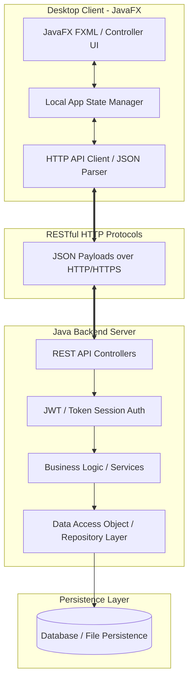

# 🍔 miniSnappFood

[](https://www.oracle.com/java/)
[](https://openjfx.io/)
[](https://github.com/MParsa-ES/miniSnappFood)
[](LICENSE)


> **miniSnappFood** is a robust, full-stack food delivery management platform built with **Java**. Inspired by Iran's leading food delivery application (SnappFood), this project features a custom modular **Java REST API Backend** and a dynamic, responsive **JavaFX Desktop Client Application**.

>**For the Front End project please visist [SnappFoodFront](https://github.com/MParsa-ES/SnappFoodFront)**

---

## 📋 Table of Contents

- [Overview](#-overview)
- [Key Features](#-key-features)
  - [👤 Customer Portal](#-customer-portal)
  - [🏪 Restaurant Manager Portal](#-restaurant-manager-portal)
  - [🛵 Admin & Delivery Management](#-admin--delivery-management)
- [System Architecture](#-system-architecture)
- [Tech Stack](#-tech-stack)
- [Project Directory Structure](#-project-directory-structure)
- [Getting Started](#-getting-started)
  - [Prerequisites](#prerequisites)
  - [Backend Setup](#1-backend-setup)
  - [Client Setup](#2-client-setup)
- [API Documentation Overview](#-api-documentation-overview)
- [Screenshots & UI Preview](#-screenshots--ui-preview)
- [Contributing](#-contributing)
- [License & Author](#-license--author)

---

## 🔍 Overview

**miniSnappFood** models the end-to-end ecosystem of a modern food delivery service. The core backend processes business logic, handles secure authentication, manages data persistence, and exposes RESTful HTTP endpoints. The frontend is a modern desktop client crafted in JavaFX with custom CSS styling, FXML layout architectures, and asynchronous API calls to deliver a fluid user experience.

---

## ✨ Key Features

### 👤 Customer Portal
* **User Authentication & Profile:** Secure register/login, role management, user profile updates, and digital wallet balance management.
* **Restaurant Discovery:** Search, filter, and browse restaurants by food category, rating, and delivery radius.
* **Interactive Menu & Cart:** View categorized menus, item details, add/remove items dynamically, and real-time total order calculation.
* **Order Placement & Tracking:** Checkout flow with digital wallet payment, live order status updates (e.g., *Submitted, Preparing, On the Way, Delivered*), and order history logs.
* **Reviews & Ratings:** Submit reviews and star ratings for completed orders.

### 🏪 Restaurant Manager Portal
* **Dashboard & Menu Management:** Add, edit, or toggle availability of menu items, manage pricing, descriptions, and food tags.
* **Live Order Processing:** Receive real-time incoming orders, update status (Accept, Prepare, Ready for Dispatch).
* **Analytics & Reports:** Sales summary, order volume metrics, and customer feedback management.

### 🛵 Admin & Delivery Management
* **Order Dispatch System:** Track active deliveries and assign couriers.
* **Platform Administration:** Manage user accounts, verify new restaurant applications, and platform activity logs.

---

## 📐 System Architecture



---

## 💻 Tech Stack

### **Backend (Server)**
* **Language:** Java 17+ / Java 21
* **Framework / API:** Java HTTP Server / RESTful Controller Architecture
* **JSON Processing:** Jackson / Gson
* **Security & Auth:** Password Hashing (BCrypt) & Token-based Authentication

### **Frontend (Client)**
* **GUI Framework:** JavaFX 21
* **Layout & Styling:** FXML + Custom CSS (Material / Modern UI theme)
* **Asynchronous I/O:** Java `HttpClient` / `CompletableFuture` (Non-blocking UI threads)

### **Build & Tooling**
* **Build System:** Apache Maven / Gradle
* **IDE Support:** IntelliJ IDEA / VS Code / Eclipse

---

## 📁 Project Directory Structure

```text
miniSnappFood/
├── server/                      # Backend REST API Server Application
│   ├── src/
│   │   └── main/
│   │       └── java/
│   │           └── com/minisnappfood/server/
│   │               ├── config/          # Server configuration & constants
│   │               ├── controllers/     # REST Controllers / Route handlers
│   │               ├── models/          # Entity models (User, Restaurant, Order, etc.)
│   │               ├── services/        # Business logic layer
│   │               ├── repository/      # Data persistence / Storage handlers
│   │               └── ServerApp.java   # Server entry point
│   └── pom.xml
│
├── client/                      # JavaFX Desktop Client Application
│   ├── src/
│   │   └── main/
│   │       ├── java/
│   │       │   └── com/minisnappfood/client/
│   │       │       ├── controllers/     # FXML UI Controllers
│   │       │       ├── network/         # API HTTP Client Service
│   │       │       ├── models/          # Client-side data models
│   │       │       └── ClientApp.java   # JavaFX Application entry point
│   │       └── resources/
│   │           ├── fxml/                # FXML UI layout files
│   │           ├── css/                 # Modern UI Stylesheets
│   │           └── images/              # Assets & icons
│   └── pom.xml
│
└── README.md                    # Project Documentation
```

---

## 🚀 Getting Started

### Prerequisites

Ensure you have the following installed on your environment:
- **Java Development Kit (JDK 17 or higher)**
- **Maven 3.8+** or **Gradle**
- **Git**

Verify your Java setup:
```bash
java -version
mvn -version
```

---

### 1. Backend Setup

1. **Clone the Repository:**
   ```bash
   git clone https://github.com/MParsa-ES/miniSnappFood.git
   cd miniSnappFood
   ```

2. **Navigate to Server Directory & Build:**
   ```bash
   cd server
   mvn clean install
   ```

3. **Run the Server:**
   ```bash
   mvn exec:java -Dexec.mainClass="com.minisnappfood.server.ServerApp"
   ```
   *The server will start listening on `http://localhost:8080` (or configured port).*

---

### 2. Client Setup

1. **Navigate to Client Directory:**
   ```bash
   cd ../client
   ```

2. **Build and Run the JavaFX Application:**
   ```bash
   mvn clean javafx:run
   ```

---

## 📡 API Documentation Overview

| Endpoint | Method | Description | Access |
| :--- | :---: | :--- | :---: |
| `/api/auth/register` | `POST` | Register a new user account | Public |
| `/api/auth/login` | `POST` | Authenticate user & receive access token | Public |
| `/api/restaurants` | `GET` | Fetch list of available restaurants | Public / User |
| `/api/restaurants/{id}/menu` | `GET` | Retrieve menu for a specific restaurant | Public / User |
| `/api/orders` | `POST` | Create a new food order | Customer |
| `/api/orders/user/{id}` | `GET` | Fetch order history for user | Customer |
| `/api/orders/{id}/status` | `PUT` | Update order status | Restaurant / Delivery |

---


## 📜 License & Author

Distributed under the **MIT License**. See `LICENSE` for more details.

**Authors:**
* **MohammadParsa Esmaeili** ([@MParsa-ES](https://github.com/MParsa-ES))
* **MohammadAmin Vali** ([@EqualizerV](https://github.com/EqualizerV))
* Computer Engineering Students @ Amirkabir University of Technology (Tehran Polytechnic)